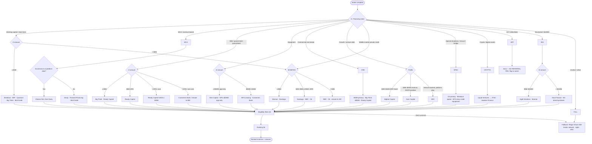

# Deal Routing Decision Tree — Specification

**Baird Augustine — Retail Debt Partner Network**

This document specifies a decision tree ("Deal Router") that takes a borrower intake profile and returns a ranked list of lending partners from the network, with disqualification reasons and an escalation path when nothing matches. It is the routing logic behind the question *"we have a client who needs X — who do we send them to?"*

Companion documents: `LENDER-CAPABILITIES-SUMMARY.md` (capabilities per lender), `data/lenders.json` (source of truth). Last updated: July 14, 2026.

---

## 1. Goals and Non-Goals

**Goals**

- G1 — Route any inbound deal to the best-fit partner(s) in under a minute using only facts collectable on a first call.
- G2 — Never route to a partner whose hard eligibility rules the deal visibly violates (prohibited industry, below minimum revenue/FICO, outside deal-size range).
- G3 — Prefer partners where BA actually gets paid: signed agreements with documented economics rank above everything else.
- G4 — Always return *something*: when no direct lender matches, fall through to the advisory/marketplace partners rather than a dead end.

**Non-Goals**

- Predicting approval odds or pricing — the tree filters and ranks, it does not underwrite.
- Replacing judgment on relationship-sensitive deals (the relationship owner can always override).
- Handling equity raises; this network is debt only.

---

## 2. Intake Inputs

All inputs collectable on a first call. Fields marked ● are required; the rest refine ranking.

| # | Input | Type | Notes |
|---|---|---|---|
| I1 ● | Financing need | enum | See §3 top-level branches (working capital, equipment, CRE, SBA, growth debt, MCA/RBF, special situations, structured/large, crypto, art/collectibles, unknown) |
| I2 ● | Requested amount | USD | Single number; ranges use the midpoint |
| I3 ● | Industry | string → enum | Normalized against the exclusion lists in §5 |
| I4 | Annual revenue | USD | Monthly revenue × 12 accepted |
| I5 | Monthly revenue | USD | Needed for the sub-$2M working-capital branch |
| I6 | Time in business | months | |
| I7 | Guarantor FICO | integer | Best-known estimate is fine |
| I8 | EBITDA | USD | Middle-market branches only |
| I9 | ARR / recurring revenue % | USD / % | SaaS & growth-debt branch only |
| I10 | Collateral type | enum | real estate · equipment · AR/inventory · crypto · art · none/cash-flow |
| I11 | Geography | enum | US state · Canada · other; rural flag for USDA; Texas flag (Dexly first-position rule) |
| I12 | Urgency | enum | days · weeks · months |
| I13 | Situation flags | set | turnaround · negative EBITDA · pre-revenue · sponsor-backed · existing senior lender · ecommerce platform connected |

---

## 3. Top-Level Tree

Branch first on **financing need (I1)**, then gate by **amount (I2)**, then filter on eligibility (§5), then rank (§6).



---

## 4. Branch Definitions

Candidate pools per branch. A lender may appear in several branches; the filter/rank stages decide.

| Branch | Trigger (I1 + gates) | Candidate pool (in default priority order) |
|---|---|---|
| **WC** — Working capital ≤ $2M | working capital, term loan, LOC, payroll, refinance of MCA | Breakout Finance, ARF Financial, Quantum, Big Think Capital, Biz2Credit |
| **MCA** — MCA / RBF | merchant advance, revenue advance, factor-rate product acceptable | Clearco (if ecommerce), Dexly, Forward Financing, Biz2Credit |
| **SBA** — Government-guaranteed | borrower wants/qualifies for SBA or USDA | Big Think (≤ $5M), Ready Capital ($350K–$7M; USDA ≤ $25M), Customers Bank ($10M+ revenue borrowers) |
| **EQ** — Equipment | purchase, refinance, sale-leaseback, cash-out on equipment | Slim Capital, NFS Leasing, Big Think, Biz2Credit |
| **CRE** — Commercial real estate | acquisition, refi, bridge, construction on investment RE | BDIM, Big Think (≤ $50M), Ready Capital |
| **GROWTH** — Growth / venture debt | non-dilutive growth capital for tech / recurring-revenue | Bigfoot ($2M–$15M ARR), Hum ($3M–$50M revenue), ARC (venture-backed), Monroe (SaaS/ARR at scale) |
| **MM** — Middle-market private credit | cash-flow term debt, unitranche, sub debt, acquisitions | Monroe (≥ $5M EBITDA), Saratoga (≥ $2M EBITDA or $5M ARR), National Business Capital, C6 |
| **SPEC** — Special situations | rescue, covenant relief, event-driven, turnaround, IPO bridge | C6, Breakout (speed), NFS (story-credit equipment) |
| **CRYPTO** — Digital assets | BTC-backed or crypto-business financing | Liquid Ventures → JTSA (prospect — confirm agreement first), Awaken Finance |
| **ART** — Art / collectibles | UHNW collection-backed line ≥ $10M | Aera only — **no referral economics; route only with owner sign-off** |
| **BIG** — Structured / large | ≥ $100M or complex structured/trade/project finance | Haut Finance ($100M–$1B), Agile Solutions ($5M–$150M), Monroe (hold ≤ $300M) |
| **FALL** — Fallback | no branch fits or zero survivors after filters | Reiger Shore (300-lender network), Agile Solutions, ARC |

Routing rules that cut across branches:

- **R1** — Amount ≥ $100M forces branch BIG regardless of stated need.
- **R2** — "Speed: days" (I12) inserts Breakout Finance (funds in 1–2 days) into any SMB-scale branch as a candidate.
- **R3** — Situation flag *turnaround / negative EBITDA* adds C6 and NFS to the candidate pool and removes bank lenders (Customers Bank, Ready Capital).
- **R4** — Flag *existing senior lender* promotes National Business Capital (sits behind senior debt) within MM.
- **R5** — Deals > $150M in BIG are worked by BA directly or with Haut; Agile only takes < $150M.

---

## 5. Eligibility Filters (Hard Disqualifiers)

Applied to every candidate after branch selection. A failed hard filter removes the lender and records a reason string (§7). Unknown values do **not** disqualify — they downgrade confidence (§6).

### 5.1 Amount range

| Lender | Min | Max |
|---|---|---|
| Breakout Finance | — | $2M ($500K bridge) |
| ARF Financial | $5K ($15K–$50K min draws) | $1.5M |
| Quantum | — | $250K term / $150K LOC |
| Big Think Capital | $5K | $5M SBA / $50M CRE / $1M LOC |
| Biz2Credit | $25K | ~$2M+ |
| Forward Financing | $5K | $500K |
| Dexly Finance | $75K | $5M |
| Clearco | $10K | $10M+ |
| Slim Capital | — | $500K app-only (tiered below) |
| NFS Leasing | $150K | $15M |
| BDIM | $1M (case-by-case below) | none stated |
| Ready Capital | $350K (SBA) | $7M SBA / $25M USDA |
| Customers Bank | $3M | — |
| Bigfoot Capital | $1M | $5M |
| Hum Capital | $1M | $7M |
| Saratoga | $5M | $75M |
| Monroe | — | $300M hold (min $5M EBITDA) |
| National Business Capital | $250K | $15M |
| C6 | $250K | $15M+ |
| Agile Solutions | ~$5M | $150M |
| Haut Finance | $100M | $1B |
| Aera | $10M | — |

### 5.2 Industry exclusions

| Lender | Prohibited / restricted |
|---|---|
| Breakout Finance | agriculture, finance/insurance, mining, real estate/leasing, transportation/warehousing |
| Quantum | firearms, tobacco, gambling, marijuana, non-profits, motor vehicle dealers; construction/retail/transportation/RE/food service = higher-risk (soft penalty) |
| Dexly | used auto dealers, cannabis, financial services, religious services; restricted industries require $1M+ monthly revenue |
| Forward Financing | cannabis, firearms, adult entertainment, financial firms |
| NFS Leasing | cannabis, long-haul trucking, firearms |
| Slim Capital (cash-out) | medical equipment, commercial printers, forestry equipment, Class 8 sleepers |
| Clearco | effectively ecommerce/DTC only — non-ecommerce is a hard fail |
| Bigfoot | B2B software / tech-enabled services only |
| Ready Capital (USDA) | non-rural locations are a hard fail for the USDA product |

### 5.3 Financial minimums

| Lender | Revenue | FICO | Time in business | Other |
|---|---|---|---|---|
| Breakout Finance | $50K+/mo | 580+ | 12+ mo | |
| ARF Financial (P&I LOC) | $50K+/mo sales | 575+ | 30+ days revenue | IO products: 651+, 3–4+ yrs, home ownership |
| Quantum | $150K+/yr | 680+ | 12+ mo | ≤10 NSFs/3mo, ≤1 active MCA, $3K+ avg balance |
| Biz2Credit (RBF) | $250K+/yr | 575+ | 12+ mo | Term: 650+, 18+ mo |
| Dexly | — ($1M+/mo if restricted industry) | — | 12+ mo | ≤5 negative days last month; no bankruptcies; TX first-position |
| Big Think | by product (see summary) | 450–660 by product | by product | |
| Slim Capital | by tier | 600–680 by tier | 1–5 yrs by tier | |
| Bigfoot | $2M–$15M ARR | — | — | 20%+ growth, 50%+ recurring, margin floors |
| Hum | $3M–$50M/yr | — | — | DSCR-based, 2.5–5%+ YoY growth |
| Saratoga | $2M+ EBITDA or $5M+ ARR | — | — | |
| Monroe | $5M+ EBITDA | — | — | SaaS may qualify on ARR |
| National Business Capital | $2M–$100M+/yr | 620+ | 1–2+ yrs | |
| Customers Bank | $10M+/yr, profitable | — | — | 1.25x DSCR |
| Haut Finance | revenue ≥ 4× loan | — | — | |
| Aera | guarantor NW $50M–$100M+ | — | — | 2× collateral coverage, 15–20% liquidity held at bank |

### 5.4 Status gate

- **Signed** → routable.
- **In Progress** → routable **with a warning**: economics may be undocumented; owner must confirm the agreement state before making the introduction.
- **Prospect** (JTSA, Raiseview, Ondeck) → never auto-routed; surfaced as "potential — agreement required first".
- **No Program** (GMO, Aera) → never auto-routed; surfaced only as reference with the reason ("no referral economics").

---

## 6. Ranking

Survivors of §5 are scored 0–100. Sort descending; ties broken by relationship-owner preference, then alphabetically.

| Factor | Weight | Scoring |
|---|---|---|
| Agreement status | 35 | Signed = 35 · In Progress = 15 · else 0 |
| Sweet-spot fit | 25 | Amount within lender's stated sweet spot = 25 · within hard range but outside sweet spot = 12 |
| Economics documented | 15 | Referral split on file = 15 · "pending/TBD" = 5 |
| Requirement headroom | 15 | All known minimums cleared with ≥ 25% margin = 15 · barely cleared = 8 · any input unknown = 5 |
| Speed match | 10 | Lender funding speed meets I12 urgency = 10 |

**Confidence tag** (shown alongside score): `high` = all required inputs present and no unknowns among the lender's hard filters; `medium` = 1–2 unknowns; `low` = 3+ unknowns. Unknowns never disqualify (G4) but cap confidence.

---

## 7. Output Contract

The router returns:

```json
{
  "matches": [
    {
      "lender": "Breakout Finance",
      "score": 87,
      "confidence": "high",
      "status": "Signed",
      "why": ["amount $750K within up-to-$2M range", "funds in 1-2 days meets 'days' urgency"],
      "warnings": [],
      "economics": "Up to 3% of funded principal",
      "owner": "Robert/Ryan",
      "contact": "Andrew Moss — amoss@breakoutfinance.com"
    }
  ],
  "disqualified": [
    { "lender": "Quantum", "reason": "FICO 610 < required 680" }
  ],
  "fallback": null
}
```

- `matches` — max 5, score-ordered. Each carries human-readable `why` reasons so the relationship owner can sanity-check the routing.
- `disqualified` — every candidate removed by a hard filter, with the exact rule that removed it (G2 auditability).
- `fallback` — populated with the FALL branch (Reiger Shore / Agile / ARC) whenever `matches` is empty (G4), plus a note explaining what disqualified everyone.

---

## 8. Data Mapping & Normalization

The tree cannot run directly off the free-text fields in `data/lenders.json` (`Deal Size`, `Revenue Requirements`, etc. are prose). Implementation requires a structured `routing` block added per lender record:

```json
"routing": {
  "branches": ["WC", "SPEC"],
  "amountMin": 0,
  "amountMax": 2000000,
  "sweetSpotMin": 250000,
  "sweetSpotMax": 2000000,
  "monthlyRevenueMin": 50000,
  "ficoMin": 580,
  "monthsInBusinessMin": 12,
  "prohibitedIndustries": ["agriculture", "finance", "mining", "real-estate", "transportation"],
  "fundingSpeedDays": 2,
  "geography": ["US"],
  "specialFlags": ["speed", "covenant-relief"]
}
```

Normalization rules:

- N1 — Free-text ranges parse to `amountMin`/`amountMax`; "no stated max" → `null` (treated as unbounded).
- N2 — Industry strings map to a shared industry enum; unmapped industries route to FALL rather than guessing.
- N3 — Where the workbook is silent on a threshold, omit the key — the filter skips it and the confidence tag absorbs the uncertainty (§6).
- N4 — The `routing` block is maintained alongside the prose fields; the prose stays the display source, `routing` is the logic source.

---

## 9. Worked Examples

1. **$400K working capital, restaurant, $80K/mo revenue, FICO 600, 3 yrs, needs money this week.**
   Branch WC. Quantum fails (FICO < 680); Biz2Credit term fails (FICO < 650) but RBF path survives. Ranked: **ARF Financial** (restaurant-friendly LOC, Signed) ≈ **Breakout** (speed 10 pts, Signed) > Big Think (working capital) > Biz2Credit RBF (In Progress, warning).

2. **$8M unitranche for a $4M-EBITDA software company, sponsor-backed.**
   Branch MM (EBITDA < $5M → MM2). Monroe disqualified (EBITDA below $5M unless ARR path argued). Ranked: **Saratoga** (in range, but In Progress — warning) > **C6** ($8M within range, Signed) > NBC ($8M ≤ $15M, Signed, promoted if a senior lender exists — R4).

3. **$300M trade-finance facility, agriculture exporter.**
   R1 forces branch BIG; > $150M → **Haut Finance** (Signed, 50/50) or BA direct/syndicate. Agile excluded by R5.

4. **$50K advance for a cannabis dispensary.**
   Branch MCA. Forward, Dexly, Quantum all prohibit cannabis; Clearco fails (not ecommerce). Matches empty → **fallback**: Reiger Shore network, plus note that Slim Capital has a cannabis *equipment* program if the need can be reframed (branch EQ).

---

## 10. Implementation Notes & Open Questions

- **Phase 1 (manual):** this spec + the summary doc used as a desk reference. No code.
- **Phase 2 (CRM wizard):** a "Find a Lender" panel in `index.html` — intake form (§2) → filter/rank engine (§5–6) → output card (§7). The dataset is already inlined in the page; only the `routing` blocks (§8) need adding.
- **Keep in sync:** any change to a partner's status, economics, or criteria in the workbook must flow into the `routing` block; a stale block violates G2. A CI-less check: the CRM can render a "routing data older than lenders.json" warning by comparing a version stamp on each.

**Open questions for Ryan/Robert**

1. Should In-Progress partners be routable at all, or held back until signed? (Spec currently routes them with a warning — §5.4.)
2. Confirm the Dexly Texas first-position rule blocks second-position TX deals outright, or just re-prices them.
3. JTSA: is the drafted referral agreement (Drive link on file) considered active enough to route crypto deals, or does Liquid Ventures remain the only entry point?
4. Ranking weights (§6) are a first proposal — adjust after the first ~10 routed deals are reviewed against what the owners would have chosen.
